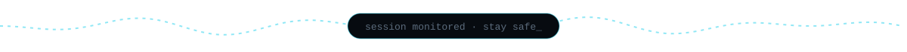

  

  I like security that can prove itself. 
  Everything I publish comes with the tests that show it works, and that fail the moment it doesn't.

  

### `~/projects`

  
  
  
  

### `~/toolbox`

  

### `~/activity`

  

  

